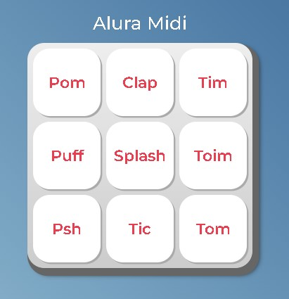

  

  

Este projeto tem como objetivo criar uma aplicação que eproduz o som dos instrumentos musicais que estão armazenados dentro de um elemento áudio do HTML.

## Oque eu aprendi
<ul>
    <li>Funções</li>
    <li>Listas</li>
    <li>Iterando em listas</li>
    <li>Eventos e lógicas</li>
</ul>

## Tecnologias utilizadas durante o curso
* Javascript

## Tecnologias utilizadas no projeto
* HTML
* CSS